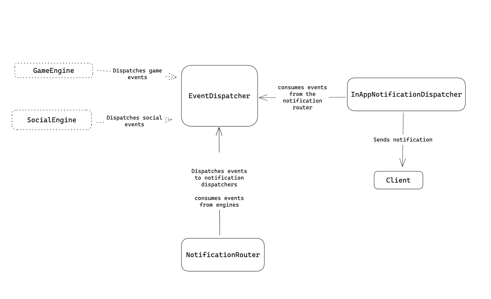

# Real-Time Notification System for a Gaming Platform

## Running instructions

```
npm run install
npm run start
```


## **Scope**

This project focuses on the design and implementation of a real-time notification service. The game engine and the social services are out of the scope of this document, and it is also assumed that the clients are capable of receiving the notifications in real time.

## **Requirements**

A player should receive real-time notifications about **in-game events** when:

- The player reaches a new level
- The player acquires a new item
- The player completes a challenge
---

A player should receive real-time notifications about **social events** when:

- Another player sends a friend request
- A friend request is accepted by another player
- When another player starts following them

---

## Design Overview
To handle the distribution of notifications, we are using an observable pattern, leveraging Node's EventEmitter class to create an entity that the game engine, social engine, and Notification Router will use to dispatch and subscribe to events. Then in the notifications router, we use a strategy pattern to define the creation of notifications based on the event type.




## Classes

### Event Dispatcher:

Handles events from the different engines and emits to the subscribers: Notification Router, Notification Dispatcher.

### Notification Router:

Selects the right strategy to create a notification based on the event type and routes notifications to the corresponding notification dispatcher based on the user's notification preferences.

### In-App Notification Dispatcher:

Dispatches notifications to the client; this one particularly dispatches for in-game notifications.

### Game Engine:

A testing class to simulate triggering in-game events, like a player leveling up or acquiring an item.

### Social Engine:

A testing class to simulate triggering social events, like a player receiving a friendship request.
